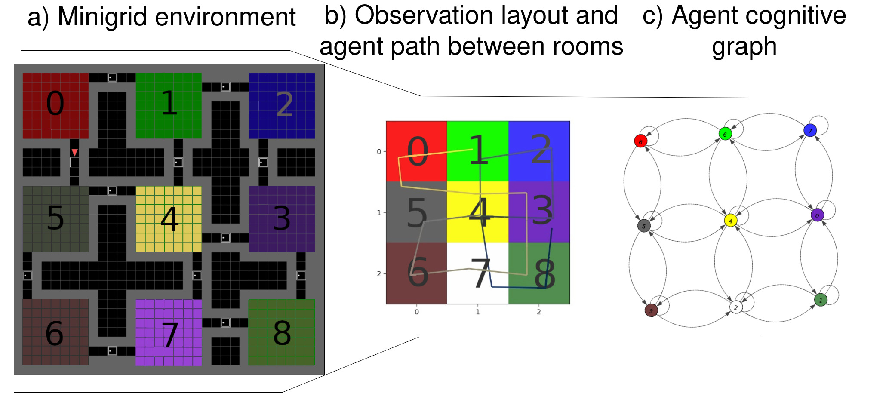
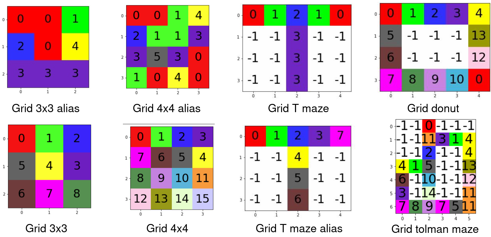

# higher_level_nav


This work presents a navigation model at the highest level of abstraction with the agent reasoning over motions from room to room. 
Observations are considered filtered from RGB to a single colour integer by a sub-process.
The image below gives an example of the whole pipeline where, from left to right, you can see what a minigrid environment is expected to looks like, what the highest level actually receives as input (single colour info, corresponding to the floor colour) and what the model generates as a topological map once it has finished exploring

For testing purposes, the colour indexes have been set, but the model could generates the integers internally as it sees new observations. 




## Setup

From the higher_level_nav repository: 
```
docker built -t high_nav .
./launch_docker.sh 
```

## Tests

Exploration:
```
python3 navigation_testbench.py --inf_algo 'VANILLA' --env grid_donut --model ours_v4_2 --max_steps 2 -p 0 -p 0
```

Goal oriented (can also work without loading models):
```
python3 navigation_testbench.py --load_model results/grid_donut/ours_exploration/ours_v4_2_MMP/ours_v4_2_MMP_2024-02-27-09-32-43/ours_v4_2_MMP.pkl --inf_algo 'MMP' --env grid_donut --model ours_v4_2_MMP --max_steps 15 -p 0 -p 0 --goal 12 --stop_condition goal_reached
```

All results are saved in the /results folder.

We are based upon pymdp, with some small modifications to allow dynamic growth of the model and have the MMP/ Vanilla work for any prediction length and any number of steps. The pymdp model can be found in the agent folder, all significantly modified methods are explicitely identified.  

**parameters:**

`--inf_algo`: You can choose the inference algorithm between MMP and VANILLA. 

`--env`: Select an environment among the selection below (you can create more envs in envs/minigrid.py)

`--model`: Which model to use between `cscg`, `ours_v1`, `ours_v3`, `ours_v4`, `ours_v4_2` (among ours, only the latest version is assured to work well.), `cscg` can be run with or without `random_policy` -> `cscg_random_policy`.

`--max_steps`: How many steps the agent is allowed to take before the program stops (failsafe)

`-p -p`: starting position as -p x -p y

`--load_model`: path to a specific model to charge as a .pkl

`--goal`: observation we want to reach, the number correspond to a colour (see environments)

`--stop_condition`: failsafe to stop the model when it reaches a particular condition. Honestly, it is not really used. 


## Versionning
All versions can only go toward cardinal directions or stay in the current locations.

Ours_v3: VANILLA type navigation with state inferred on latest action, observation A and B

Ours_v4: either VANILLA or MMP type navigation (switchable whenever during run -tried from MMP to VANILLA, not the contrary-), state inferring improved.

Ours_v4_2: added linear increase of policies, policies of different lengths and the lookahead is a distance instead of the number of consecutive actions. Basically useless policies like 4x STAY or move stay move or left right have been removed, transforming an exponential increase of policies wth lookahead to a linear (or polinomial with STAY) problem. 
A lot of variables to play around with, most un-used after verifying they are not good options. If you find variables that are not defined in the Readme, they are probably not interesting to play with and are not improving the model. 

## environements

See below all environments that could be chosen:



You can create new envs in envs/minigrid.py, they have to start with "grid" to be recognised as minigrid envs by the automatic benchmark. 


## Cite

For further information about this work, refers to:
